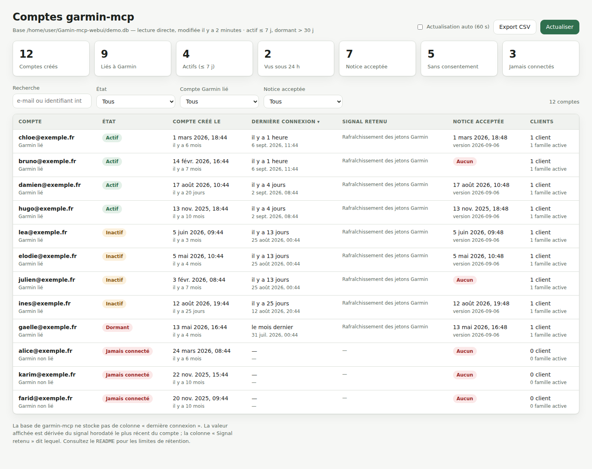
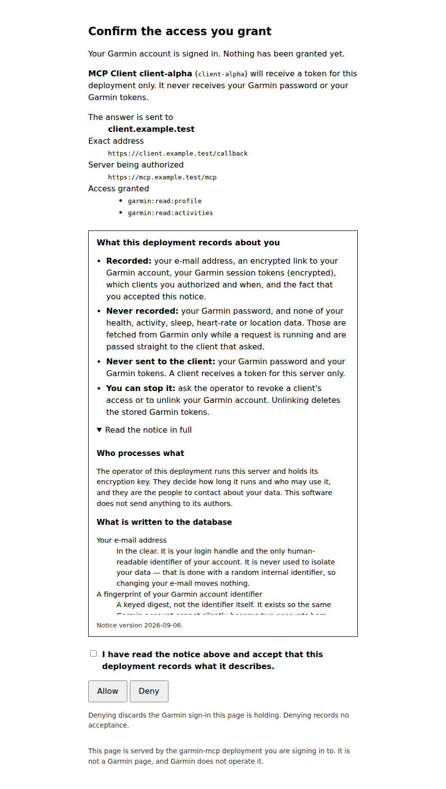
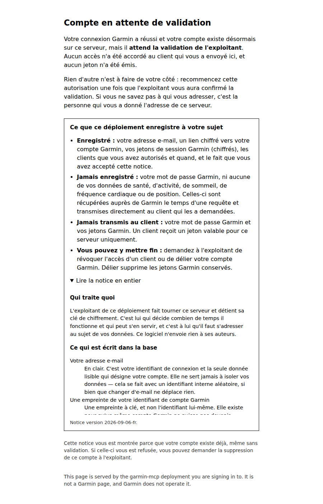

# Gamin-mcp-webui

Le serveur MCP **[garmin-mcp](https://github.com/tamcore/garmin-mcp)** et une **interface web de
consultation des comptes**, dans un seul dépôt et une seule image Docker.

Le serveur amont, écrit en Go, authentifie plusieurs comptes via OAuth 2.1 en mode `remote` et
garde leur état dans une base SQLite. Il n'expose aucune page ni API d'administration : impossible
de savoir, depuis le serveur lui-même, qui a créé un compte ni quand ce compte s'est connecté pour
la dernière fois. Ce dépôt ajoute cette vue et fait tourner les deux ensemble.

Le serveur amont est vendorisé dans `garmin-mcp/` par `git subtree` : c'est une copie versionnée
du dépôt public, mettable à jour d'une commande (voir « Suivre l'amont »), et non un simple
téléchargement au moment du build.



```
              conteneur unique
┌───────────────────────────────────────────────┐
│  garmin-mcp serve  ──écrit──►  /data/garmin.db│  :8180  endpoint MCP + login OAuth
│  (Go, OAuth 2.1)               (SQLite, WAL)  │
│                                    ▲   ▲      │
│  interface web  ────lit (RO)───────┘   │      │  :8080  interface + API JSON
│  (FastAPI)      ────valide────────────►┘      │           (écrit account_approvals)
└───────────────────────────────────────────────┘
                    /data : base + clé maîtresse + TLS (volume)
```

Les deux processus tournent sous le même compte de service, condition nécessaire pour qu'une base
SQLite en mode WAL soit lisible par le second. Le conteneur s'arrête dès que l'un des deux
s'arrête, pour que la politique de redémarrage de Docker s'applique à l'ensemble.

## Ce que l'interface affiche

| Colonne              | Origine |
| -------------------- | ------- |
| Compte               | `principals.email_normalized` — l'e-mail est l'identifiant de connexion, la seule donnée en clair du compte. |
| Garmin lié           | présence de `principals.garmin_account_hash`. |
| Compte créé le       | `principals.created_at`. |
| Dernière connexion   | dérivée (voir ci-dessous). |
| Signal retenu        | le fait horodaté qui porte la date affichée. |
| Clients / familles   | `consents` non révoqués et `token_families` actives. |
| Notice acceptée      | dernière ligne de `privacy_notice_consents` (voir plus bas). |
| Validation           | `account_approvals` : en attente, validé ou bloqué (voir plus bas). |

Le détail d'un compte ajoute la liste complète des signaux, ses acceptations de la notice de
confidentialité, les clients OAuth autorisés avec leurs portées, les familles de jetons et, si la
table est alimentée, les événements d'audit.

## Comment la « dernière connexion » est calculée

**Le schéma de garmin-mcp n'a pas de colonne « dernière connexion ».** Il stocke des faits
horodatés ; l'interface prend le plus récent d'entre eux et indique lequel a gagné.

| Signal | Source | Ce qu'il prouve |
| ------ | ------ | --------------- |
| Rafraîchissement des jetons Garmin | `garmin_token_sets.updated_at` | usage réel : les jetons Garmin sont réécrits à chaque rafraîchissement. |
| Émission d'un jeton MCP | `max(mcp_tokens.issued_at)` via `token_families` | le client MCP a obtenu un jeton d'accès ou l'a fait tourner. |
| Autorisation dans le navigateur | `max(auth_codes.created_at)` | passage complet par la page de login. |
| Consentement accordé | `max(consents.granted_at)` | consentement donné à un client MCP. |
| Événement d'audit | `max(audit_events.occurred_at)` | table présente dans le schéma, sans écrivain dans les versions 0.0.x. |
| Mise à jour du compte | `principals.updated_at` | repli, retenu seulement s'il est postérieur à `created_at`. |

Un compte dont aucun signal ne dépasse sa date de création est classé **jamais connecté** —
`updated_at` vaut alors `created_at` et ne prouve aucune connexion.

États dérivés (seuils configurables) : **actif** ≤ 7 j, **inactif** ≤ 30 j, **dormant** au-delà,
**jamais connecté** sans aucun signal.

### Limites à connaître

- **Rétention.** La tâche de nettoyage de garmin-mcp supprime les codes et les jetons expirés.
  Un compte inactif depuis longtemps peut donc voir sa dernière connexion « reculer » sur un
  signal plus ancien mais persistant (consentement, jetons Garmin). Les consentements, eux, ne
  sont jamais supprimés par le nettoyage.
- **Rien n'est instrumenté côté requête.** garmin-mcp n'écrit pas d'horodatage de dernier appel
  d'outil ; la granularité est donc celle de l'émission des jetons, pas celle de chaque requête
  MCP. Pour une vraie mesure d'usage, il faudrait un correctif amont alimentant `audit_events` —
  cette interface l'affichera automatiquement si la table se remplit.
- **Identité Garmin.** Le nom Garmin du compte est chiffré dans la base (`garmin_identity_sealed`)
  et n'est déchiffrable qu'avec la clé maître du serveur. L'interface ne la demande pas et
  n'affiche donc que l'e-mail.

## Le guide destiné aux utilisateurs

[docs/connecter-garmin-a-claude.md](docs/connecter-garmin-a-claude.md) est la notice à
donner aux personnes qu'on invite sur un déploiement : brancher le connecteur dans
Claude, se connecter à Garmin, accepter la notice de confidentialité, puis attendre la
validation de l'exploitant. Elle décrit aussi ce que le serveur enregistre et ce qu'il
n'enregistre pas, en langage courant.

Elle est écrite pour **ce** déploiement : l'URL du serveur MCP et l'identifiant de
client OAuth qu'elle donne sont ceux d'une installation particulière, à remplacer par
les vôtres. Les captures des écrans de Claude sont à déposer dans
[docs/captures/](docs/captures/), qui liste celles que le guide attend ; celles des deux
pages servies par le serveur lui-même sont déjà là.

## Le consentement de l'utilisateur

Ce dépôt ajoute au serveur amont une **fenêtre de consentement** : la page qui conclut
le login dans le navigateur — celle qui porte *Autoriser* et *Refuser* — affiche désormais ce
que le déploiement enregistre et ce qu'il n'enregistre pas, et l'acceptation est
enregistrée en base.



- **Un résumé toujours visible** : ce qui est enregistré, ce qui ne l'est jamais, ce que
  reçoit le client MCP, et comment arrêter le traitement.
- **Le texte intégral à la demande**, dans un dépliant sur la même page — aucun second
  chargement, donc rien qui puisse échouer entre la lecture et l'acceptation.
- **Une case à cocher que le serveur vérifie.** Accorder sans cocher est refusé côté
  serveur, pas seulement par le navigateur : la page revient, la session reste vivante,
  rien n'a été accordé. Refuser, en revanche, n'exige aucune acceptation.
- **On ne redemande pas.** Qui a déjà accepté le texte servi voit la date de son
  acceptation à la place de la case.

### Ce qui est enregistré, et pourquoi c'est l'empreinte qui compte

Une ligne par compte et par texte accepté, dans la table `privacy_notice_consents`
(migration `0003` du serveur) : l'identifiant interne du compte, **l'empreinte SHA-256
du texte exact affiché**, le libellé de version que portait ce texte, et l'instant de la
première acceptation.

C'est l'empreinte, et non le libellé, qui décide si l'on redemande. Un libellé s'oublie
au moment d'éditer le texte ; une empreinte non. Modifier la notice — un mot, un titre,
ou sa traduction complète en français — change l'empreinte, ne correspond plus à aucune
ligne, et fait donc réaccepter tout le monde, sans qu'aucune action d'exploitation ne
soit nécessaire.

Réaccepter le même texte garde le premier instant : c'est celui-là qui a eu lieu.
Accepter un texte différent ajoute une ligne au lieu d'en remplacer une, donc l'historique
de ce qui a été accepté survit.

### Modifier le texte

Il est dans `garmin-mcp/internal/loginweb/pages/remote/privacy.html`, en deux blocs
(résumé et texte intégral), **en français**. Le modifier ou le traduire est une édition de
ce seul fichier ; l'empreinte changeant, chacun le réacceptera. Pensez à remonter
`PrivacyNoticeVersion` dans `garmin-mcp/internal/loginweb/privacy.go` pour que la ligne
enregistrée porte aussi un libellé lisible. Le détail est dans
[garmin-mcp/docs/privacy-notice.md](garmin-mcp/docs/privacy-notice.md).

**Tout le login distant est en français**, pas seulement le bloc de notice : les sept
pages de `garmin-mcp/internal/loginweb/pages/remote/` — annonce, identifiants Garmin,
code à usage unique, consentement, attente de validation, connexion expirée, page
terminale — et les messages d'erreur que ces pages affichent. Le profil « loopback », celui de la commande
`garmin-mcp login` que seul l'exploitant utilise depuis son terminal, reste en anglais
comme en amont. C'est le prix à payer : chaque fichier traduit est un conflit potentiel à
la prochaine mise à jour du subtree, ce qui est acceptable pour des pages que vos
utilisateurs lisent et ne l'était pas pour un outil d'exploitation.

Le texte livré décrit ce que ce build fait réellement, vérifié contre le schéma. **Si
vous changez ce que le serveur stocke, la notice fait partie du changement** — et c'est
l'opérateur du déploiement qui reste responsable du traitement et de ce que la notice
promet.

### La page qui clôt le login

Un login réussi se termine par une redirection vers le client : la dernière page que la
personne voit est celle de Claude, pas celle du serveur. La transaction est alors close
et son cookie effacé — c'est voulu, une transaction terminée ne doit plus être
adressable.

Conséquence : **toute requête ultérieure sur une route `/login…` tombe sur une page
terminale**, et c'est le cas normal quand la fenêtre d'autorisation est rouverte,
rechargée, ou revisitée avec le bouton « précédent » après coup. Cette page dit
maintenant ce qui s'est passé — « Si vous venez d'autoriser l'accès, tout s'est bien
passé » — au lieu du *Nothing here* amont, qui se lisait comme une panne alors que le
connecteur venait de se connecter.

Seules `/authorize` et les quatre routes `/login…` servent cette page. Une adresse
inconnue du déploiement obtient le 404 nu du serveur HTTP, sans mise en forme : si
quelqu'un vous montre une page blanche portant `404 page not found`, il n'était pas dans
le login.

### Côté interface

L'interface montre, par compte, la date de la dernière acceptation et sa version, ou une
pastille *Aucun* pour un compte qui n'a jamais accepté de notice — l'état normal d'un
compte antérieur à la mise en place. Deux tuiles comptent les deux populations, un filtre
isole les comptes sans consentement, le détail liste toutes les acceptations avec leur
empreinte, et l'export CSV porte les mêmes colonnes.

## Écrire les séances dans Garmin

Par défaut, un déploiement est en lecture seule. Pour que Claude puisse **créer, envoyer
et planifier des séances** dans le compte Garmin de la personne, deux choses doivent
être vraies en même temps :

1. `GARMIN_MCP_ENABLE_WRITE_TOOLS=true` — sinon les outils d'écriture ne sont pas
   servis du tout ;
2. le client OAuth déclare la portée `garmin:workouts:write`, et la personne l'accorde
   sur la page de consentement, qui la lui affiche nommément.

```
GARMIN_MCP_ENABLE_WRITE_TOOLS=true
GARMIN_MCP_OAUTH_CLIENTS=[{"id":"claude-web-desktop","name":"Claude",
  "redirect-uris":["http://127.0.0.1:33418/callback"],
  "scopes":["garmin:read","garmin:workouts:write"],
  "resources":["https://mcp.exemple.fr/mcp"],"public":true}]
```

Les deux conditions sont nécessaires, et c'est ce qui rend le réglage sûr : activer les
outils ne donne rien tant que personne n'a consenti, et consentir ne donne rien si le
serveur ne les sert pas.

**La portée est fine.** `garmin:workouts:write` couvre exactement onze outils —
`create_run_workout`, `create_strength_workout`, `create_walk_run_workout`,
`create_z2_walk_workout`, `upload_workout`, `upload_workouts`, `update_workout`,
`schedule_workout`, `schedule_workouts`, `schedule_week` — et rien d'autre. Le poids, la
nutrition, les activités, le matériel relèvent de portées distinctes qui restent
refusées faute d'avoir été accordées.

**Vérifier ce que le serveur sert vraiment**, sans deviner :

```console
$ docker compose exec garmin-mcp garmin-mcp doctor | grep -A3 "tool tiers"
tool tiers:
  write: enabled
  destructive: disabled
```

**Supprimer reste impossible.** `delete_workout` et `unschedule_workout` sont classés
destructifs : ils demandent `GARMIN_MCP_ENABLE_DESTRUCTIVE_TOOLS=true` *et* la portée
`garmin:workouts:destructive`, ni l'un ni l'autre activés ici.

Changer les portées d'un client est une **ré-autorisation** : les jetons existants ont
été émis pour les anciennes, et chaque personne devra repasser par la page de
consentement. La notice de confidentialité, elle, n'a pas à changer — elle dit déjà que
le client reçoit un jeton « limité aux permissions affichées sur cette page », ce qui
reste exact quelles que soient ces permissions.

## La validation des comptes

Par défaut, **un nouveau compte n'est utilisable qu'une fois validé dans l'interface**.
Quelqu'un qui se connecte avec ses identifiants Garmin obtient un compte, voit une page
qui le lui dit, et n'obtient rien d'autre : aucun consentement enregistré, aucun code
d'autorisation, aucun jeton.



| Où | Ce qui se passe |
| -- | --------------- |
| Page de consentement | un compte non validé y accède normalement : un bandeau annonce l'attente, et **il peut accepter la notice dès maintenant**. Son acceptation est enregistrée. |
| Au clic sur *Autoriser* | l'acceptation est écrite, puis la porte s'applique : compte non validé → page « en attente », transaction OAuth close, aucun jeton. |
| À chaque requête MCP | la lecture du jeton d'accès refuse un compte non validé. Retirer une validation coupe l'accès **à la requête suivante**, pas au prochain login. |
| Dans l'interface | colonne *Validation*, filtre, tuile, et les boutons *Valider* / *Bloquer* / *Remettre en attente*. |

L'ordre compte : accepter la notice est la décision de la personne sur ses propres
données, et elle n'a pas à attendre la décision de l'exploitant sur son accès. Une fois
validée, la personne relance l'autorisation depuis son client et **la notice ne lui est
pas redemandée**.

Trois états : **en attente** (personne n'a décidé), **validé**, **bloqué**. « En attente »
n'est jamais stocké — c'est l'absence de ligne dans `account_approvals`, si bien qu'un
compte tout juste créé attend par construction, sans que rien n'ait eu à s'exécuter. La
migration `0004` valide en revanche tous les comptes qui existaient déjà : activer la
porte sur un déploiement en cours ne met personne dehors.

Le réglage `GARMIN_MCP_REQUIRE_ACCOUNT_APPROVAL` (défaut `true`) commande la porte. À
`false`, on retrouve le comportement amont : un compte est utilisable dès que son login
Garmin a réussi.

### Être prévenu par e-mail

Rien n'annonce un compte retenu : sans notification, on l'apprend quand la personne se
plaint. Renseignez un serveur SMTP et le déploiement envoie un message par compte mis
en attente.

| Variable | Rôle |
| -------- | ---- |
| `GARMIN_MCP_SMTP_HOST` | le serveur. **Vide n'envoie rien**, c'est le défaut. |
| `GARMIN_MCP_SMTP_PORT` | `587` en STARTTLS (défaut), `465` en TLS implicite. |
| `GARMIN_MCP_SMTP_USER` | le compte d'envoi. Avec Gmail, l'adresse complète. |
| `GARMIN_MCP_SMTP_SECRET_FILE` | **fichier** contenant le secret, lisible par le seul propriétaire. Avec Gmail, un mot de passe d'application. |
| `GARMIN_MCP_SMTP_FROM` | l'expéditeur. Vide reprend `SMTP_USER`, ce que Gmail impose de toute façon. |
| `GARMIN_MCP_SMTP_TO` | les destinataires, séparés par des virgules. |
| `GARMIN_MCP_SMTP_TLS` | `starttls` ou `implicit`. Il n'y a pas de mode en clair. |
| `GARMIN_MCP_DASHBOARD_URL` | lien vers l'interface, placé dans le message. |

**Le secret n'est pas une variable d'environnement**, et ce n'est pas un oubli : le
serveur amont refuse par principe qu'un identifiant soit configurable — un test le
vérifie — donc seul le *chemin* d'un fichier l'est, comme pour la clé maîtresse. Le
fichier doit appartenir au compte de service et n'être lisible que par lui, sinon le
démarrage échoue. Avec Gmail, générez un **mot de passe d'application** (la validation
en deux étapes doit être active sur le compte) et écrivez-le seul dans ce fichier.

Trois garanties, chacune couverte par un test :

- **Un envoi ne retarde ni ne fait échouer un login.** Il part en tâche de fond, sur un
  contexte détaché de la requête, et ses erreurs sont journalisées puis abandonnées.
- **Un compte n'est annoncé qu'une fois par intervalle** (six heures). Trois tentatives
  de connexion font un seul message ; un retour une semaine plus tard fait un rappel.
  Un envoi qui échoue ne consomme pas l'intervalle.
- **Une configuration incomplète refuse de démarrer.** Nommer un serveur et oublier les
  destinataires est une erreur qu'on ne découvrirait qu'en ne recevant rien.

Le message contient l'adresse e-mail du compte, son identifiant interne et l'heure —
aucune donnée Garmin. **La notice de confidentialité le dit**, puisque cette adresse
transite alors par un tiers que vous avez choisi.

### L'interface écrit, mais une seule table

C'est la seule exception à la lecture seule, et elle n'est pas une convention de code :
la connexion d'écriture installe un **autorisateur SQLite** qui refuse, avant exécution,
toute écriture ailleurs que dans `account_approvals` et toute modification de schéma. Un
test le vérifie en essayant huit requêtes interdites.

La route d'écriture est `POST /api/accounts/{id}/approval`, protégée en plus contre une
écriture déclenchée depuis un autre site : elle n'accepte que du JSON et refuse un
en-tête `Origin` qui ne désigne pas l'interface — nécessaire parce que le navigateur
rejoue tout seul l'authentification HTTP Basic.

Si l'interface tourne séparément avec le volume monté en lecture seule, la validation est
impossible : la route répond `409` en le disant, et la consultation continue de marcher.

## Sécurité

Ce qui suit concerne l'interface web. Le modèle de menace du serveur MCP lui-même — isolation des
comptes, chiffrement des jetons, gestion des clés — est celui du projet amont, décrit dans
`garmin-mcp/docs/threat-model.md`.

- **Lecture seule, sauf une table.** Les connexions de consultation sont ouvertes en
  `mode=ro` avec `PRAGMA query_only`, et un test vérifie qu'un `DELETE` échoue. La seule
  écriture de toute l'interface est la validation des comptes, bornée à `account_approvals`
  par un autorisateur SQLite — voir « La validation des comptes ».
- **Conteneur non privilégié.** L'entrypoint n'est root que le temps d'ajuster l'appartenance de
  `/data`, puis redescend sur un compte de service via `setpriv`. La racine du système de fichiers
  peut rester en lecture seule (`read_only: true` dans le compose), `/data` est en `0700`, et les
  deux ports servis sont publiés sur la boucle locale.
- **Deux ports, deux publics.** `8180` est l'endpoint MCP et les pages de login OAuth, destinés aux
  utilisateurs ; `8080` est l'interface d'exploitation, qui affiche leurs adresses e-mail. Ne les
  exposez pas au même public.
- **Aucun secret ne sort.** Les colonnes `*_hash` (empreintes) et `*_sealed` (enveloppes
  chiffrées) ne sont jamais sélectionnées ni renvoyées ; un test parcourt les réponses de
  l'API pour s'en assurer.
- **Authentification obligatoire.** Le service refuse de démarrer sans `WEBUI_PASSWORD` ni
  `WEBUI_API_TOKEN`, sauf `WEBUI_ALLOW_ANONYMOUS=1` assumé explicitement. Les comparaisons de
  secrets passent par `secrets.compare_digest`.
- **Données personnelles.** L'interface affiche des adresses e-mail : exposez-la sur une adresse
  privée, derrière un reverse proxy en TLS, et activez `WEBUI_MASK_EMAILS=1` si un affichage
  partiel suffit. La page envoie `noindex, nofollow`.

## Démarrage rapide

```bash
cp .env.example .env      # renseignez au minimum WEBUI_PASSWORD et l'URL publique
docker compose up -d --build
```

L'image compile le serveur Go depuis `garmin-mcp/` puis l'embarque avec l'interface web.
L'interface écoute sur `127.0.0.1:8080`, l'endpoint MCP sur `127.0.0.1:8180`. Au premier
démarrage, le serveur crée sa clé maîtresse, migre sa base et commence à servir ; l'interface
affiche « base introuvable » les quelques secondes qui précèdent.

### Essai sur un poste, sans reverse proxy

Le serveur d'autorisation **refuse de nommer un émetteur en clair** : l'URL publique doit être
`https`, et aucun override ne change cela (`allow-insecure-http` ne lève que le contrôle sur
l'écoute et l'origine). Pour un essai local, laissez le conteneur terminer le TLS avec un
certificat auto-signé :

```bash
GARMIN_MCP_SELF_SIGNED_TLS=1 \
GARMIN_MCP_PUBLIC_URL=https://127.0.0.1:8180/mcp \
GARMIN_MCP_BIND_ADDRESS=127.0.0.1:8180 \
GARMIN_MCP_OAUTH_CLIENTS='[{"id":"claude-desktop","name":"Claude Desktop","redirect-uris":["http://127.0.0.1:33418/callback"],"scopes":["garmin:read"],"resources":["https://127.0.0.1:8180/mcp"],"public":true}]' \
WEBUI_PASSWORD=demo \
docker compose up --build
```

Le certificat est écrit une fois dans `/data/tls` et n'est jamais remplacé. Il est fait pour un
essai, pas pour une mise en production : un client MCP refusera une autorité inconnue.

### En production

Mettez un reverse proxy TLS devant, et donnez au serveur l'URL publique **de ce proxy** :

| Réglage | Valeur |
| ------- | ------ |
| `GARMIN_MCP_PUBLIC_URL` | `https://mcp.exemple.fr/mcp` — l'URL que voient les clients. |
| `GARMIN_MCP_BIND_ADDRESS` | `0.0.0.0:8180`, avec `GARMIN_MCP_ALLOW_INSECURE_HTTP=true` puisque le proxy termine le TLS. |
| `GARMIN_MCP_TRUSTED_PROXY_CIDRS` | le réseau du proxy, sans quoi aucun en-tête `X-Forwarded-*` n'est cru. |
| `GARMIN_MCP_OAUTH_CLIENTS` | au moins un client ; il n'y a pas d'enregistrement dynamique. |

Alternative sans proxy : montez vos propres `GARMIN_MCP_TLS_CERT_FILE` et
`GARMIN_MCP_TLS_KEY_FILE`, le serveur termine alors le TLS lui-même.

**Sauvegarde.** La base et la clé maîtresse sont les deux moitiés d'une même sauvegarde : une base
sans sa clé est illisible. Sauvegardez `/data` en entier, avec le processus arrêté ou via la
sauvegarde en ligne de SQLite. Voir `garmin-mcp/docs/operations.md`.

### Ne lancer qu'un service

`RUN_SERVICES` vaut `les-deux` (défaut), `mcp` ou `webui`. Deux conteneurs issus de la même image,
l'un en `mcp` et l'autre en `webui` sur le même volume, sont une configuration valide — le second
bascule alors sur une copie temporaire de la base si le volume lui est monté en lecture seule, et
la validation des comptes n'est alors pas possible depuis ce conteneur.

### En local, sans conteneur

```bash
python -m venv .venv && source .venv/bin/activate
pip install -r requirements-dev.txt

# Pour essayer l'interface sans base de production :
python scripts/demo_database.py /tmp/demo.db
WEBUI_DATABASE_PATH=/tmp/demo.db WEBUI_PASSWORD=demo python -m app
# http://127.0.0.1:8080 — identifiants : admin / demo
```

Le serveur MCP seul se compile comme n'importe quel programme Go :

```bash
cd garmin-mcp && go build ./cmd/garmin-mcp && ./garmin-mcp tools list | grep ' tools:'
```

## Configuration

### Serveur MCP

Chaque réglage de garmin-mcp a une variable d'environnement : la clé en majuscules, tirets
remplacés par des soulignés, préfixée `GARMIN_MCP_`. La liste complète est dans
`garmin-mcp/docs/configuration.md`. Les principales pour cette image :

| Variable | Défaut dans l'image | Rôle |
| -------- | ------------------- | ---- |
| `GARMIN_MCP_PUBLIC_URL` | — | **Obligatoire.** URL publique de l'endpoint MCP. Doit être `https`. |
| `GARMIN_MCP_OAUTH_CLIENTS` | — | **Obligatoire.** Registre des clients OAuth, en JSON. |
| `GARMIN_MCP_BIND_ADDRESS` | `0.0.0.0:8180` | écoute dans le conteneur. |
| `GARMIN_MCP_ALLOW_INSECURE_HTTP` | `false` | autorise une écoute et une origine en clair hors boucle locale. Ne rend jamais un émetteur en clair acceptable. |
| `GARMIN_MCP_TRUSTED_PROXY_CIDRS` | vide | réseaux dont les en-têtes `X-Forwarded-*` sont crus. |
| `GARMIN_MCP_TLS_CERT_FILE` / `_KEY_FILE` | — | le serveur termine le TLS lui-même. |
| `GARMIN_MCP_SELF_SIGNED_TLS` | `0` | ajout de cette image : fabrique un certificat auto-signé dans `/data/tls` pour un essai local. |
| `GARMIN_MCP_DATABASE_PATH` | `/data/garmin.db` | base SQLite, partagée avec l'interface. |
| `GARMIN_MCP_MASTER_KEY_FILE` | `/data/keys/key-v1.json` | la valeur sélectionne le répertoire ; le nom de fichier appartient au serveur. |
| `GARMIN_MCP_STATE_DIR` | `/data` | état hors base. |
| `GARMIN_MCP_ENABLE_WRITE_TOOLS` | `false` | sert les outils d'écriture. Sans portée accordée, ils restent refusés — voir « Écrire les séances ». |
| `GARMIN_MCP_ENABLE_DESTRUCTIVE_TOOLS` | `false` | sert les outils de suppression. Exige aussi `ENABLE_WRITE_TOOLS` et une portée `:destructive`. |
| `GARMIN_MCP_REQUIRE_ACCOUNT_APPROVAL` | `true` | ajout de ce dépôt : un nouveau compte attend une validation dans l'interface. |

### Conteneur

| Variable | Défaut | Rôle |
| -------- | ------ | ---- |
| `RUN_SERVICES` | `les-deux` | `les-deux`, `mcp` ou `webui` : ce que l'entrypoint lance. |
| `APP_USER` | `webui` | compte de service auquel l'entrypoint redescend après avoir ajusté `/data`. |

### Interface web

Toutes les variables sont facultatives sauf le secret d'accès.

| Variable | Défaut | Rôle |
| -------- | ------ | ---- |
| `WEBUI_DATABASE_PATH` | `/data/garmin.db` | base SQLite de garmin-mcp (sa clé `database-path`). |
| `WEBUI_USERNAME` | `admin` | identifiant HTTP Basic. |
| `WEBUI_PASSWORD` | — | mot de passe HTTP Basic. Obligatoire (voir `WEBUI_ALLOW_ANONYMOUS`). |
| `WEBUI_API_TOKEN` | — | jeton porteur pour l'API JSON (`Authorization: Bearer …`). |
| `WEBUI_ALLOW_ANONYMOUS` | `0` | ouvre l'interface sans authentification. À réserver à un proxy qui authentifie déjà. |
| `WEBUI_MASK_EMAILS` | `0` | masque les e-mails (`a***@e***.fr`) dans l'interface et les exports. |
| `WEBUI_ACTIVE_DAYS` | `7` | seuil « actif », en jours. |
| `WEBUI_IDLE_DAYS` | `30` | seuil « inactif », en jours. Doit dépasser `WEBUI_ACTIVE_DAYS`. |
| `WEBUI_SNAPSHOT_TTL_SECONDS` | `5` | durée de validité de la copie quand la lecture directe échoue. |
| `WEBUI_TITLE` | `Comptes garmin-mcp` | titre affiché. |
| `WEBUI_HOST` / `WEBUI_PORT` | `0.0.0.0` / `8080` | écoute HTTP. |
| `WEBUI_LOG_LEVEL` | `info` | niveau de log uvicorn. |

## API

Toutes les routes `/api` sauf `/api/health` exigent une authentification.

| Route | Description |
| ----- | ----------- |
| `GET /` | l'interface. |
| `GET /api/health` | sonde publique : `{"status": "ok", "database_readable": true}`. |
| `GET /api/status` | chemin, taille et mode d'accès de la base, seuils, libellés des signaux. |
| `GET /api/stats` | compteurs agrégés (total, liés à Garmin, actifs, vus sous 24 h…). |
| `GET /api/accounts` | liste paginée. Paramètres : `search`, `status`, `linked`, `consent`, `sort`, `order`, `limit`, `offset`. |
| `GET /api/accounts.csv` | même liste au format CSV, mêmes filtres. |
| `GET /api/accounts/{id}` | détail d'un compte : signaux, acceptations de la notice, consentements, familles de jetons, audit. |
| `POST /api/accounts/{id}/approval` | valide, bloque ou remet en attente. Corps JSON `{"state": "approved"\|"blocked"\|"pending", "note": "…"}`. |
| `GET /api/docs` | documentation OpenAPI générée. |

```bash
curl -u admin:motdepasse 'http://127.0.0.1:8080/api/accounts?status=dormant'
curl -H "Authorization: Bearer $WEBUI_API_TOKEN" http://127.0.0.1:8080/api/stats
```

## Développement

```bash
pip install -r requirements-dev.txt
ruff check . && ruff format --check .
pytest -q                       # interface web

cd garmin-mcp && go test ./...  # serveur MCP (suite amont)

shellcheck docker/entrypoint.sh
docker build -t gamin-mcp-webui:test .
```

La CI fait les quatre : lint et tests Python sur 3.11 et 3.12, compilation du serveur Go,
`shellcheck` sur l'entrypoint, puis construction de l'image et démarrage réel du conteneur jusqu'à
ce que sa sonde de santé passe.

Les tests construisent une base SQLite au schéma de garmin-mcp (`tests/schema.sql`) peuplée de
cas limites : compte actif, inactif, dormant, jamais connecté, compte dont les jetons ont été
purgés. `tests/schema.sql` reproduit les tables et colonnes lues par `app/queries.py` ; si le
schéma amont évolue, c'est le fichier à mettre à jour — un test échouera alors immédiatement.

## Suivre l'amont

`garmin-mcp/` est un `git subtree` du dépôt public. Pour récupérer une version plus récente :

```bash
git remote add garmin-mcp-upstream https://github.com/tamcore/garmin-mcp.git   # une seule fois
git fetch garmin-mcp-upstream master
git subtree pull --prefix=garmin-mcp garmin-mcp-upstream master --squash
```

Le sous-répertoire reste modifiable comme le reste du dépôt ; `git subtree push` renvoie ces
modifications vers un fork amont si vous en tenez un. Après une mise à jour, vérifiez que
`tests/schema.sql` correspond toujours aux migrations amont — c'est ce que testent les tests de
l'interface.

## Compatibilité

Vérifié contre le schéma de garmin-mcp après les migrations `0001_initial`,
`0002_oauth_contract`, `0003_privacy_notice_consent` et `0004_account_approval` (les deux
dernières ajoutées par ce dépôt). L'interface ne dépend que des tables `principals`,
`garmin_token_sets`, `consents`, `oauth_clients`, `auth_codes`, `token_families`,
`mcp_tokens`, `audit_events`, `privacy_notice_consents` et `account_approvals`, et ne lit
aucune colonne chiffrée.

## Licence

MIT pour ce dépôt. `garmin-mcp/` est une copie du projet amont de Philipp Born, sous licence MIT
également : sa licence et ses notices d'origine voyagent avec le code, dans `garmin-mcp/LICENSE` et
`garmin-mcp/THIRD_PARTY_NOTICES.md`. Ce dépôt n'est pas un produit officiel du projet amont.
