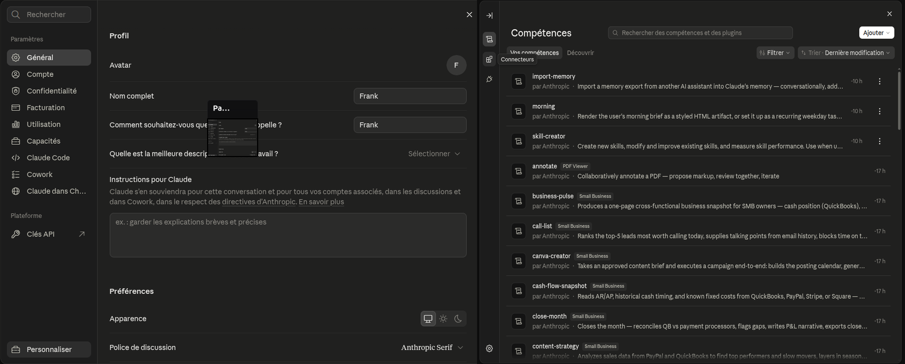
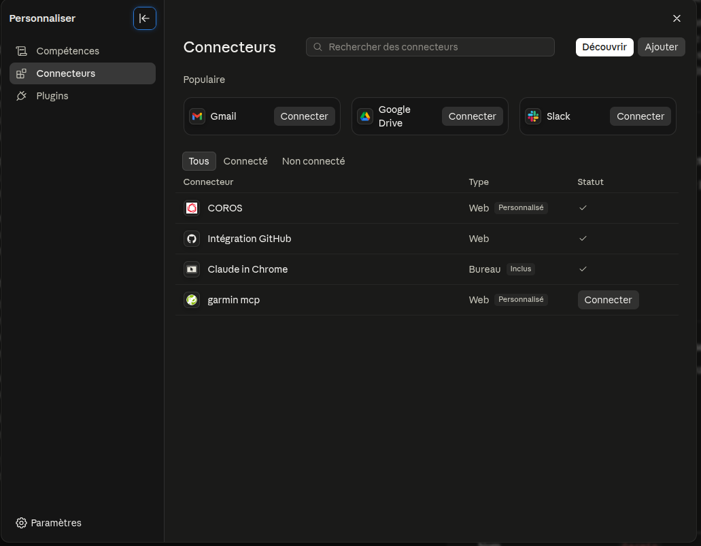
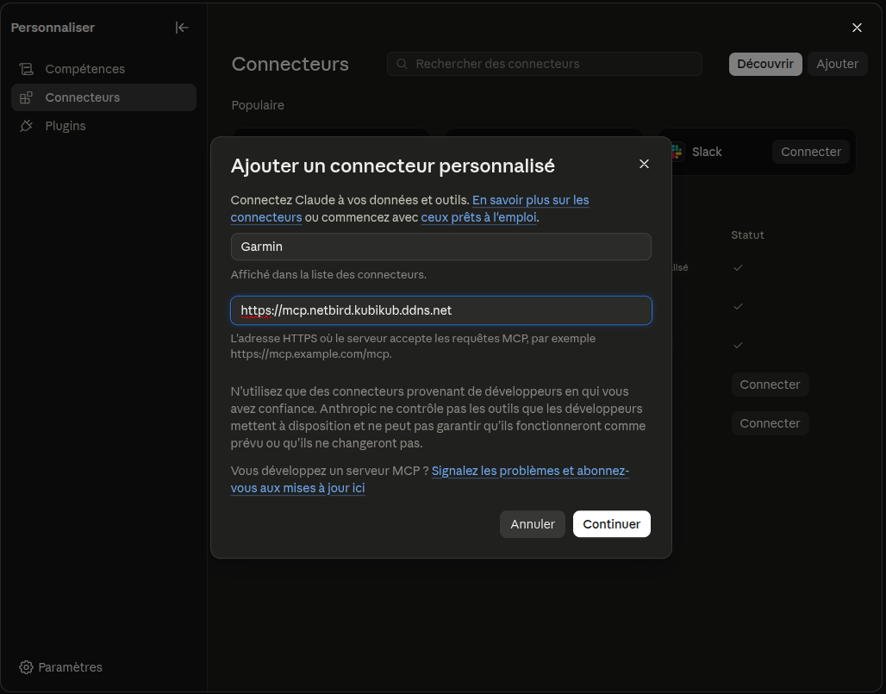
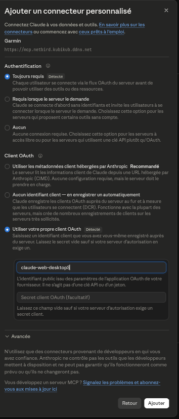
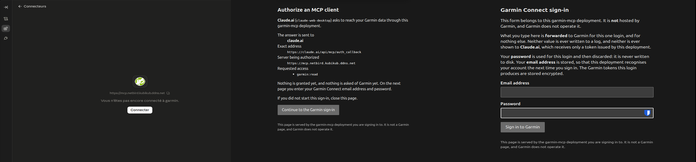
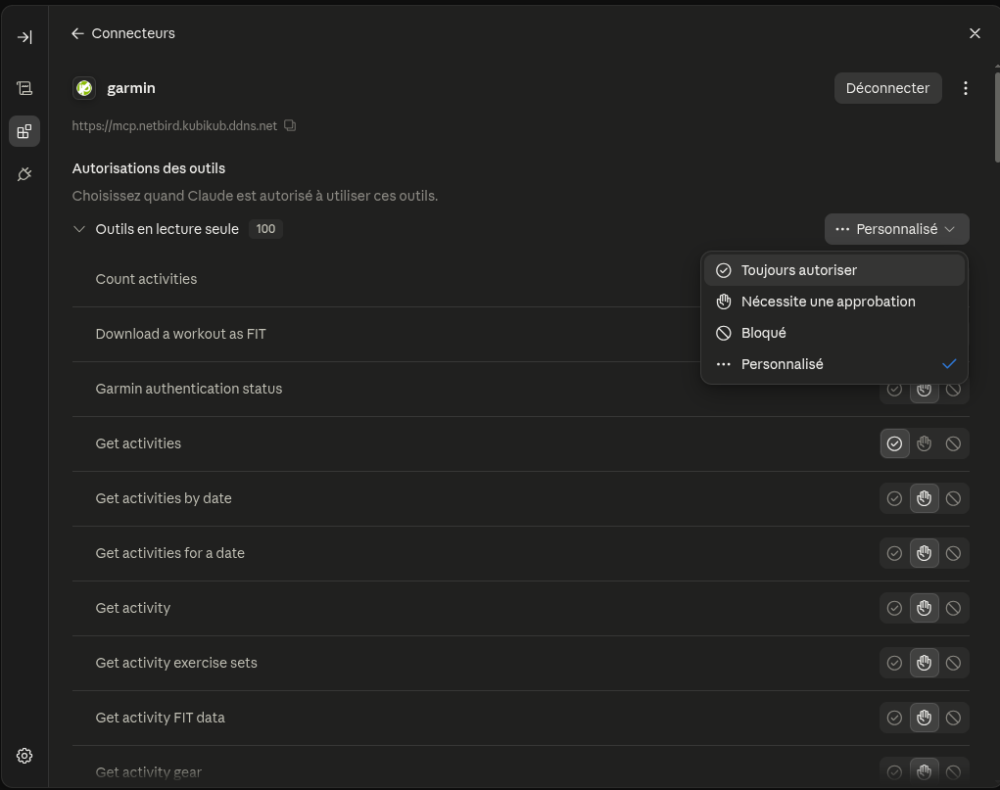
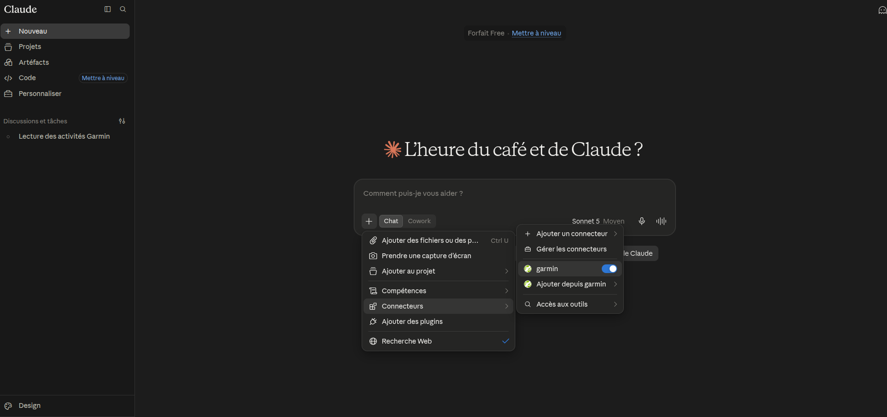

# Connecter ton compte Garmin à Claude

Ce guide t'explique comment brancher ton compte Garmin Connect sur Claude, pour pouvoir lui poser des questions sur tes entraînements, ton sommeil, ta forme, tes activités.

Compte 15 minutes la première fois. **Plus le temps que je valide ton compte** : depuis peu, un nouveau compte attend mon feu vert avant de pouvoir servir (voir l'étape 5). Préviens-moi quand tu commences, ça ira plus vite.

---

## Avant de commencer

Il te faut :

- **Un compte Claude.** Le plan gratuit suffit, mais il est limité à **un seul connecteur personnalisé**. Si tu en as déjà un, il faudra le retirer.
- **Ton compte Garmin Connect** (email + mot de passe, et ton code de double authentification si tu l'as activée).
- **Un navigateur sur ordinateur.** Fais la première connexion depuis claude.ai, pas depuis l'application mobile ou l'application de bureau.

---

## Ce que je vois, et ce que je ne vois pas

Le serveur tourne chez moi, donc autant être clair. Tu retrouveras tout ceci pendant la connexion : le serveur affiche lui-même une notice détaillée, que tu devras accepter.

**Je ne vois jamais ton mot de passe Garmin.** Tu le saisis dans un formulaire servi par le serveur, qui le transmet une seule fois à Garmin et ne le stocke nulle part. Seuls les jetons d'accès qui en résultent sont conservés, chiffrés.

**Aucune de tes données Garmin n'est stockée.** Ni sommeil, ni fréquence cardiaque, ni séance, ni position : la base du serveur n'a pas de colonne pour ça. Elles sont récupérées chez Garmin le temps d'une question et transmises à Claude, puis oubliées.

**Ce qui est enregistré**, en tout et pour tout : ton adresse email, un lien chiffré vers ton compte Garmin, tes jetons Garmin (chiffrés), les clients que tu as autorisés, le fait que tu as accepté la notice — et ma décision de validation, avec sa date.

**Une notification m'est envoyée** quand ton compte se met en attente. Elle contient ton adresse email, l'identifiant interne de ton compte et l'heure — rien d'autre, et aucune donnée Garmin. Elle passe par le service d'envoi que j'utilise, qui est donc un tiers destinataire de ton adresse. Rien ne part une fois ton compte validé.

**Tes données sont isolées des miennes et de celles des autres.** Chaque personne a son propre identifiant interne ; ton jeton ne donne accès qu'à ton compte.

**Claude peut lire toutes tes données, et écrire une seule chose : des séances.** Il peut créer un entraînement, l'envoyer dans ton compte et le placer à une date de ton calendrier Garmin. C'est tout ce qu'il peut modifier : ni ton poids, ni ta nutrition, ni tes activités, ni ton matériel — ces autorisations-là ne sont pas accordées.

**Il ne peut rien supprimer.** Effacer une séance ou la retirer du calendrier relève d'une autorisation « destructive » qui n'est pas activée. Si une séance créée ne te convient pas, supprime-la toi-même dans Garmin Connect.

**Ce que je peux voir techniquement** : ton adresse email apparaît dans la base du serveur, et je peux voir quand tu t'es connecté pour la dernière fois. Je ne consulte pas tes données d'entraînement, mais je pourrais techniquement y accéder puisque j'administre la machine. Si ça te gêne, ne fais pas cette installation — c'est une question de confiance, pas de technique.

**Une réserve honnête** : Garmin ne fournit pas d'API officielle pour ces données. Le serveur utilise des points d'accès internes de l'application web Garmin Connect. Ça peut cesser de fonctionner du jour au lendemain si Garmin change quelque chose, et ça pourrait en théorie contrevenir à leurs conditions d'utilisation. Tu installes en connaissance de cause.

---

## Étape 1 — Ouvrir les connecteurs

Sur **claude.ai**, va dans **Customize > Connectors**.

> Selon la version, ce menu peut s'appeler **Paramètres > Connecteurs**. Cherche « Connecteurs » ou « Connectors ».

---

## Étape 2 — Ajouter un connecteur personnalisé

Clique sur **Add custom connector** (ou le bouton **+** à côté de Connectors).

Renseigne :

| Champ | Valeur |
|---|---|
| **Nom** | `Garmin` |
| **URL du serveur MCP** | `https://mcp.netbird.kubikub.ddns.net` |

⚠️ **L'URL n'a rien après le nom de domaine.** Pas de `/mcp` à la fin, pas de barre oblique.

---

## Étape 3 — Le réglage qu'il ne faut pas rater

C'est **l'étape où ça échoue** si tu passes trop vite.

Ouvre **Advanced settings** (ou continue jusqu'à l'écran d'authentification, selon ta version de l'interface).

Pour **OAuth client**, choisis **« Use your own OAuth client »**, puis saisis :

| Champ | Valeur |
|---|---|
| **Client ID** | `claude-web-desktop` |
| **Client Secret** | *laisser vide* |

Les deux autres options — « Use Anthropic's hosted client metadata » et « No client ID — register one automatically » — **ne fonctionneront pas** avec ce serveur. Il n'accepte que les clients déclarés à l'avance.

Clique sur **Add**.

---

## Étape 4 — Se connecter à Garmin et accepter la notice

Clique sur **Connect** à côté du connecteur Garmin. Une page de connexion s'ouvre.

Saisis ton email et ton mot de passe **Garmin Connect** — pas ceux de Claude.

Si tu as activé la double authentification, un code te sera demandé ensuite.

Arrive alors l'écran d'autorisation. Il te dit qui demande l'accès et pour quoi — tu verras deux permissions :

| Permission | Ce qu'elle autorise |
|---|---|
| `garmin:read` | lire tes données : activités, sommeil, fréquence cardiaque, forme… |
| `garmin:workouts:write` | créer une séance, l'envoyer dans ton compte, la planifier |

Il affiche aussi **ce que le déploiement enregistre à ton sujet** : un résumé, et le texte complet si tu déplies « Lire la notice en entier ».

**Coche la case** « J'ai lu la notice… », puis clique sur **Allow**.

La case n'est pas décorative : sans elle, le serveur refuse et te réaffiche la même page. Rien n'est perdu, tu coches et tu recliques.

On ne te la redemandera pas aux connexions suivantes — sauf si je modifie le texte de la notice, auquel cas tu la reverras pour l'accepter à nouveau.

---

## Étape 5 — Attendre ma validation

**Si c'est ta première connexion, tu vas tomber sur cette page :**

C'est normal, et ce n'est pas une erreur. Ton compte existe maintenant sur le serveur, ce que tu viens d'accepter est enregistré, mais **je dois valider ton compte** avant qu'il serve à quoi que ce soit. Tant que ce n'est pas fait, aucun jeton n'est émis.

Ce que tu vas observer, et qui pourrait t'inquiéter : **Claude va probablement afficher une erreur d'autorisation**. C'est attendu à ce stade — le connecteur n'a rien reçu.

Ce qu'il faut faire :

1. **Je suis prévenu automatiquement** : le serveur m'envoie un e-mail dès qu'un compte
   se met en attente. Un mot de ta part reste utile si c'est urgent, mais tu n'as rien
   à faire pour que je le sache.
2. Attends que je te confirme la validation (je vois ton compte apparaître « en attente » dans mon tableau de bord).
3. **Reviens ensuite dans Claude et reclique sur Connect.** Cette fois ça passe, et la notice ne te sera pas redemandée.

⚠️ **Ne relance pas la connexion en boucle en attendant.** Chaque tentative rejoue un login Garmin, et Garmin limite ces tentatives (voir la section suivante). Une fois suffit, puis tu attends.

---

## ⚠️ Si la connexion Garmin échoue : ne réessaie pas tout de suite

C'est le point le plus important de ce guide.

Garmin limite fortement le nombre de tentatives de connexion **par compte**. Chaque essai rapproché aggrave le blocage et le prolonge.

**Si ça échoue : attends 24 heures avant de réessayer.** Ne relance pas cinq fois de suite, tu te bloquerais toi-même pour la journée entière.

Vérifie aussi que tu arrives bien à te connecter sur `connect.garmin.com` depuis ton navigateur habituel. Si ça marche là et pas ici, c'est le blocage temporaire — la patience est le seul remède.

À ne pas confondre avec l'attente de validation de l'étape 5 : là, ta connexion Garmin a réussi, il n'y a rien à réessayer, il faut juste attendre mon feu vert.

---

## Étape 6 — Autoriser les outils

Étape facile à manquer, et sans elle Claude te demandera une confirmation **à chaque appel** — soit dix ou vingt clics pour une seule question.

Toujours dans **Connectors**, clique sur le connecteur `garmin`. Tu vois une section **Autorisations des outils**, avec une ligne par catégorie et un menu déroulant à droite.

**Outils en lecture seule** → choisis **Toujours autoriser**. C'est sans risque : ils ne font que lire, et sans ça Claude te demandera une confirmation à chaque appel — dix ou vingt clics pour une seule question.

**Outils d'écriture** (création et planification de séances) → **je te conseille de laisser « Nécessite une approbation »**. Ils écrivent dans ton compte Garmin : mieux vaut voir passer chaque séance avant qu'elle y soit créée. Ils sont peu nombreux et tu ne les déclencheras qu'en le demandant, donc la gêne est minime.

---

## Étape 7 — Vérifier que ça fonctionne

Ouvre une conversation. Clique sur le bouton **+** puis **Connectors**, et vérifie que Garmin est activé pour cette conversation.

Puis demande simplement :

> Est-ce que mon compte Garmin est bien connecté ?

Claude doit répondre avec ton prénom et confirmer l'authentification.

---

## Ce que tu peux demander ensuite

- Résume-moi mes trois dernières sorties
- Comment a évolué ma fréquence cardiaque au repos ce mois-ci ?
- Quelle a été ma nuit la plus courte cette semaine ?
- Compare mon volume d'entraînement de ce mois à celui du mois dernier
- Quel est mon statut d'entraînement aujourd'hui ?
- Montre-moi mes records personnels

Claude a accès à une centaine d'outils en lecture : activités, sommeil, fréquence cardiaque, VFC, stress, Body Battery, charge d'entraînement, VO2 max, appareils, records, badges.

Et, puisqu'il peut écrire des séances, tu peux aussi lui demander :

- Crée-moi une séance de fractionné 10 × 400 m et envoie-la sur ma montre
- Construis une sortie longue en zone 2 de 1 h 30 et planifie-la dimanche
- Programme ma semaine d'entraînement à partir de ce que je viens de te décrire

Il te dira ce qu'il a créé. Vérifie dans Garmin Connect avant de partir courir : c'est ton calendrier, et il n'y a pas de bouton « annuler » côté Claude — pour supprimer une séance, passe par Garmin Connect.

---

## Se déconnecter

Va dans **Customize > Connectors**, puis retire le connecteur Garmin.

Ça coupe l'accès de Claude. Si tu veux en plus que le serveur oublie ton compte, demande-le-moi : je lance la commande qui supprime tes jetons de la base.

Je peux aussi **retirer la validation de ton compte** depuis mon tableau de bord. C'est immédiat : l'accès est coupé dès la requête suivante, sans attendre l'expiration d'un jeton.

Pour couper aussi côté Garmin, change ton mot de passe Garmin Connect — ça invalide toutes les sessions existantes.

---

## Petits problèmes courants

**« Compte en attente de validation »**
Ce n'est pas une panne : c'est l'étape 5. Préviens-moi, attends ma confirmation, puis reclique sur **Connect**.

**J'ai coché et cliqué sur Allow, et Claude affiche une erreur d'autorisation**
Le plus probable : ton compte attend encore ma validation. Regarde si la page du serveur affichait bien « Compte en attente de validation » — si oui, tout va bien, il faut juste attendre.

**La même page de consentement revient après avoir cliqué sur Allow**
La case n'était pas cochée. Coche-la et recommence, il n'y a rien d'autre à refaire.

**On me redemande d'accepter la notice alors que je l'avais déjà acceptée**
J'ai modifié le texte de la notice. Relis-le et accepte à nouveau, c'est voulu.

**Claude dit qu'il n'a pas la permission de créer une séance**
Ton autorisation date d'avant l'ajout de cette permission. Retire le connecteur, rajoute-le et reconnecte-toi : l'écran de consentement doit afficher `garmin:workouts:write`.

**« Les paramètres du serveur n'ont pas pu être déterminés »**
Continue quand même vers la configuration manuelle, et vérifie surtout que tu as bien saisi `claude-web-desktop` en Client ID.

**« Vous avez déjà un connecteur personnalisé »**
Tu es sur le plan gratuit, limité à un. Retire l'autre, ou passe sur un plan payant.

**Le connecteur apparaît mais Claude dit ne pas avoir accès**
Il n'est pas activé pour cette conversation. Bouton **+** > **Connectors** > active Garmin.

**Claude me demande d'autoriser à chaque question**
L'étape 6 a été sautée. Retourne dans **Connectors** > `garmin` > **Outils en lecture seule** > **Toujours autoriser**.

**Rien ne répond du tout**
Le serveur est peut-être arrêté ou ma connexion internet est tombée. Écris-moi.

---

## En cas de doute

Écris-moi directement. Il vaut mieux poser une question que de réessayer en boucle et se faire bloquer par Garmin pour 24 heures.
